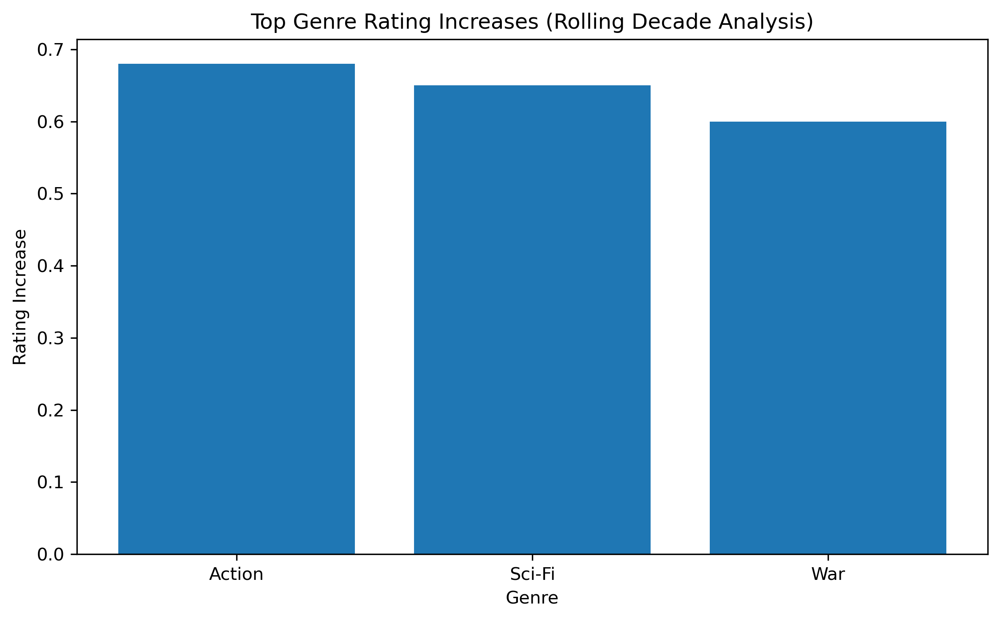

# Streaming-Scale Content Analytics with Spark: Genre Trends, Talent Performance, and Market Insights

Scalable Spark-based analytics pipeline for processing large datasets using distributed computing and SQL workflows.


> Scalable Spark-based analytics pipeline that transforms large-scale IMDb data into actionable insights for content investment, talent strategy, and international expansion.

This project uses Spark and Scala to analyze large-scale film and television metadata for strategic content insights. The pipeline combines distributed joins, window functions, ranking, and threshold-based filtering to uncover genre trends, benchmark top series, evaluate director performance, and assess localization patterns.

---

## Business Problem

Streaming platforms and media companies need scalable ways to evaluate:

- which genres show sustained or rising audience appeal
- which directors consistently deliver strong ratings
- which TV series outperform comparable long-running titles
- how translated content aligns with international market strategy

This project reframes large-scale IMDb-style data as a decision-support system for **content investment, talent strategy, benchmarking, and localization planning**.

---

## Data

- **Source:** IMDb Non-Commercial Datasets  
  https://datasets.imdbws.com/

- **Scale:** Millions of records across titles, ratings, crew, and names (updated daily)

- **Core Tables Used:**
  - `title.basics` — metadata (title type, year, genres)
  - `title.ratings` — user ratings and vote counts
  - `title.crew` — directors and writers
  - `name.basics` — person-level metadata
  - `title.episode` — TV episode structure
  - `title.akas` — localized titles

- **Key Characteristics:**
  - Tab-separated (TSV) format with missing values encoded as `\N`
  - Multi-valued fields (e.g., genres, directors) requiring parsing and explosion
  - Large-scale relational structure requiring distributed joins

- **Data Preparation Highlights:**
  - Filtering low-quality titles using vote thresholds
  - Exploding multi-valued fields (genres, directors)
  - Casting and cleaning year and rating fields
  - Joining multiple large tables for unified analysis

--- 

## Key Results

- **Genre Trend Detection (Decade-Level Analysis)**
  - Action (**+0.68**), Sci-Fi (**+0.65**), and War (**+0.60**) showed the largest increases in rolling 10-year average ratings
  - Supports **content investment timing and genre portfolio strategy**

- **Director Performance Analytics**
  - Christopher Nolan led with an average rating of **8.22** across **10** qualifying films
  - Other top performers include Hayao Miyazaki, Satyajit Ray, Quentin Tarantino, and Peter Jackson
  - Enables **data-driven talent investment and partnership decisions**

- **TV Series Benchmarking**
  - *Choufli Hal* achieved an average rating of **9.70**, outperforming the comparison group by **0.87**
  - Supports **content acquisition and programming strategy**

- **Localization Strategy (French Market Example)**
  - **26%** of qualifying French-translated titles were drama titles linked to directors with strong non-drama performance
  - Guides **international expansion and localization prioritization**

---

## Sample Outputs

All outputs are generated directly from the Spark pipeline (`scripts/spark_content_analytics.scala`) and saved for reproducibility.
Representative outputs from the Spark pipeline are included in `outputs/tables/`:

- `top_genre_trends.csv` — top genres with the largest increases in rolling 10-year average ratings
- `top_directors.csv` — highest-performing directors meeting production and vote thresholds
- `top_tv_series.csv` — benchmark of top long-running TV series against comparable titles
- `localization_summary.csv` — share of high-quality drama content among French-translated titles

### Example Highlights

- **Top genre trend opportunities:** Action, Sci-Fi, and War showed the largest gains in rolling decade-average ratings
- **Top directors by average rating:** Christopher Nolan, Hayao Miyazaki, Satyajit Ray, Quentin Tarantino, and Peter Jackson
- **Top TV series benchmark:** *Choufli Hal*, *The Why Files*, and *Ever After High*
- **Localization insight:** 26% of French-translated titles in the qualifying set were drama titles linked to directors with strong non-drama performance
---

## Example Visualization



---

## Interpretability & Business Impact

### What the Analysis Reveals

- High-performing genres show both **sustained dominance** and **periods of rapid growth**, indicating opportunities for both stable and opportunistic investments
- Director performance is highly skewed, with a small number of consistently high-performing individuals driving disproportionate value
- Top TV series distinguish themselves not only by rating but also by **episode consistency and longevity**
- Localized content (e.g., French translations) shows strong concentration in specific genres, particularly drama, reflecting **regional audience preferences**

---

### Business Applications

**1. Content Investment Strategy**
- Allocate budgets toward genres with strong long-term or rising performance trends
- Balance portfolio between stable genres and emerging high-growth categories

**2. Talent Acquisition & Partnerships**
- Identify directors with consistent high performance across multiple productions
- Inform long-term partnerships and exclusive content deals

**3. Content Benchmarking**
- Compare new or existing series against top-performing industry standards
- Support greenlighting and renewal decisions

**4. International Expansion**
- Use localization patterns to guide content translation and regional targeting
- Prioritize genres that perform well in specific international markets

---

### Key Takeaway

This project demonstrates how distributed data processing with Spark can be translated into **actionable business insights**, bridging large-scale analytics and strategic decision-making.
---

## Tech Stack

- **Languages:** Scala, SQL, Python (visualization)
- **Frameworks:** Apache Spark
- **Techniques:** Distributed joins, window functions, ranking, filtering
- **Data Processing:** Large-scale TSV ingestion and transformation
- **Visualization:** Matplotlib
---

## Repository Structure
```text
bigdata-content-analytics/
├── scripts/
│   └── spark_content_analytics.scala
├── outputs/
│   ├── tables/
│   │   ├── top_genre_trends.csv
│   │   ├── top_directors.csv
│   │   ├── top_tv_series.csv
│   │   └── localization_summary.csv
│   └── figures/
├── docs/
├── data/
└── README.md
```
---
## Reproducibility

The full analysis pipeline can be executed in a Spark environment (e.g., Hortonworks/Zeppelin).  
Outputs shown in this repository were generated from the included Scala script.
